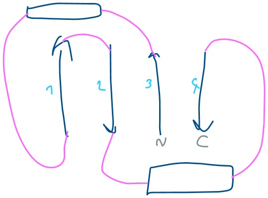

Prolin preprečuje N-glikozilacijo zaradi steričnih ovir. 

# Določanje strukture
Struktura in fn sta povezani;; zdravila ...

## Experimentalno
* kristalna difrakcija (kristali -> el. gostota -> model proteina): visoka (atomska) ločljivost, a težko pripraviti proteinske kristale
* krio-EM
* NMR: dinamični procesi (merimo razdalje med AK => structure restrictions => build an ensamble of models)
* sipanje X-ray

## Iskanje podobnih struktur
**blastp**: notr daš FASTA  
**PDBeFold**: uporablja 2°-strukture
**DALI**: gleda razdalje med AK

### blastp aka protein BLAST
ak-zaporedje najdemo na UniProtu -> fasta -> blastp, query sub-range, zbirka = **PDB**!  
Dobimo 2 epCama (ime & visoka identičnost). _scFv_: single-chain variable fragment (pri protitelesu variabilna regija: domeno se združi v 1 polipeptidno verigo -> lažje rekombinantno izražanje)

### PDBeFold
V PDB/Structures so opisane že vse strukture. En ID strukture (4MZV) daš v eFoldija. Range: chain je napisan v PDB-ju `A:139-265`.   Če klikneš na stolpec, ti izpiše manual.   
RRM = RNA-vezavna domena. 

4mzv odpremo v Chimeri. Rdeče kroglice so kristalna voda (npr. vezana s H-vezmi). Select -> Residue -> All non-standard.  
Če je na N-koncu glutamin, se lahko zunajcelično veže sam nase (post-transl. mod.) => višja stabilnost (eksopeptidaze)

Odpremo še 6nww, veriga C nas zanima: odstraniš ostale verige.

Tools -> Structure comparison -> MatchMaker.  
Vidimo, da se precej dobro poravnata (enaki elementi 2°-strukture: 2 alfa-helixa, 1 antiparal. beta-ploskev s po 4 beta-trakovi)

**topologija** = sosledje elementov 2°-strukture  

# Modeliranje proteinov
Če struktura ni znana.  
Swiss-model temelji na homologiji. 

Na UniProtu poiščemo human caludin-7. Struktura je samo prediction AlphaFolda. Urejene dele proteina je lažje/zanseljivejše napovedati. Nezanesljive so pa zanke, ki te 2°-strukture povezujejo (itak so dokaj flexibilne, usually).

Natančnost predictiona se poveča s kombinacijo večih algoritmov || z vključevanjem eksperimentalnih podatkov (restrictions by experiments). 

### Swiss-Model
Search for Templates: poišče strukture podobnih proteinov, da bo iz njih zgradil model. Tukaj ti izbereš template. Če bi dal direkt Buid, bi pa on sam izbral. 

Ko se zgradi, lahko preneseš PDB. Če klikneš na rdeč text "template", preneseš lahko še tist z gumbom na ikono datoteke. Iz PDB-ja pa lahko AlphaFold model preneseš. 

GOL = glicerol, crowding-agent (prepreči rast kristalov vode). Na desni ti prikazuje dejanske kristalne strukture označenih proteinov. 

Modele spet odpremo v Chimeri.

Swiss-Model modelira samo do tam, do koder je poravnal strukturi (npr. "odreže" repek, ki ga AlphaFold sicer pokaže, ampak ne ve, kje je ~ fleksibilnih koncev se v experimentu ne vidi, zato tudi template tistega nima, posledično tudi model ne)

Lah daš tut Structure Assessment, da vidiš Ramachandranov diagram.

-------
# Tips and tricks
Izbereš 1 ak. Up arrow key razširi selekcijo na pripadajočo 2°-strukturo in nadalje na to verigo. Naprej še pripadajoča voda, nato pa cel model.
